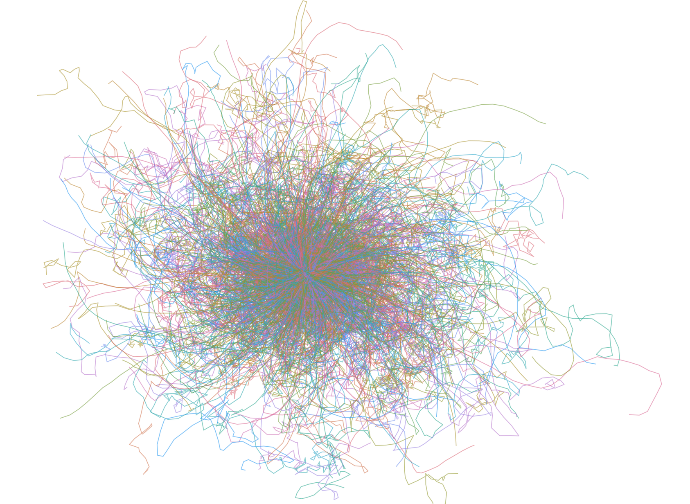
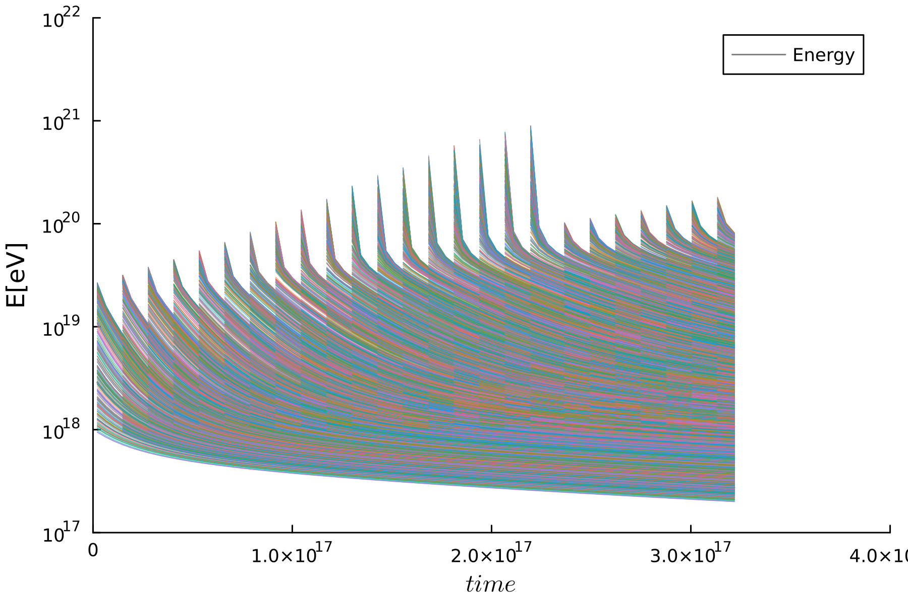
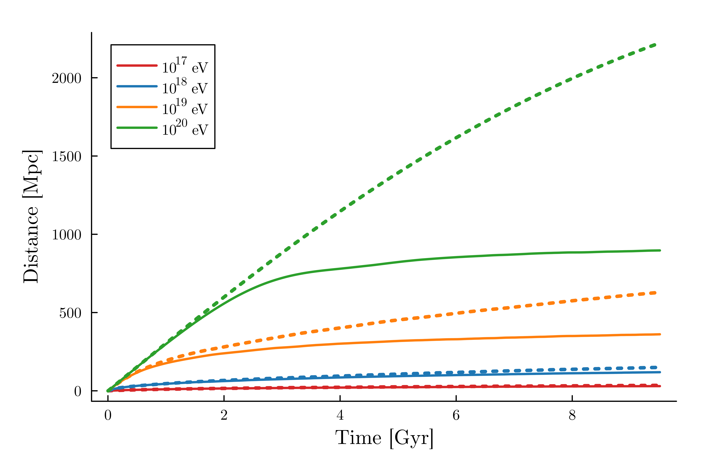

# UMAREL

 
  
 
 Parallel code in [Julia](https://julialang.org/) language to simulate the propagation of UHECRs in cosmological simulations, developed by F.Vazza, A.Firinu (University of Bologna) and C. Evoli (GSSI). 

UMAREL (*U*ltra-high-energy cosmic rays in *M*agnetic fields *A*ffected by *R*igidity diffusion and *E*nergy *L*osses) injects large sets
of cosmic rays into a simulated volume and self-consistently evolve their spatial trajectories and energies in time. See Firinu, Vazza & Evoli 2026 (submitted) for details.

## Key features

* particle propagator: Borish busher;
* loss terms: continuous loss terms from tabulated tables including interaction with the EBL and the CMB;
* sources selected from a galaxy catalog;
* cosmological effects;
* particles are evolved while the background simulation also is evolved, by combining differnt timesteps;
* multiple generation epochs of particles are allowed;
* the codes is parallelised using Julia and has been tested up to 128 processors. 

## Examples of results
This is a movie showing multiple injections of UHECRs, where each color represents a different generation of particles
 

This is the simulated propagation of 100,000 UHECR protons injected at z=1 and evolved until z=0.

This is the evolution of the energy of each simulated UHECR proton, as a function of time. Multiple spikes mark the epochs of generation of new families of UHECR protons.

This is one of the statistics which can be produced with UMAREL: the average distance covered by UHECR protons since their injection, with (solid lines) or without (dashed) the effects of extragalactic magnetic fields.

 

## What is the public version of UMAREL
The public version of UMAREL shared here is meant to work on a laptop, using multiple cores specified by the usuer, using a sequence of 3D snapshots of cosmological simulations and halo catalogs avaiable to the user. As an example, we consider the propagation within a set of HDF5 cubic fils covering an [ENZO](enzo-project.org) cosmological simulation. The user can download one sample 3D volume and its halo catalog here:
-  sample catalog of [halos](https://owncloud.ia2.inaf.it/index.php/s/7S9QsvSgyq45OXh)
-  sample ENZO 3D [dataset](https://owncloud.ia2.inaf.it/index.php/s/vrJD56wR8L6CtiY) 

The main parameter file is **parameters_UMAREL.jl**, where the possible choices are explained in detail, while in the main **UMAREL_slurm.jl** file the user can easily change the injected number of particles.  

By default, all outputs are written in a **/out** folder, which the user must locally create. 

....Umarel gives an experienced look to new UHECR problems! 
 

